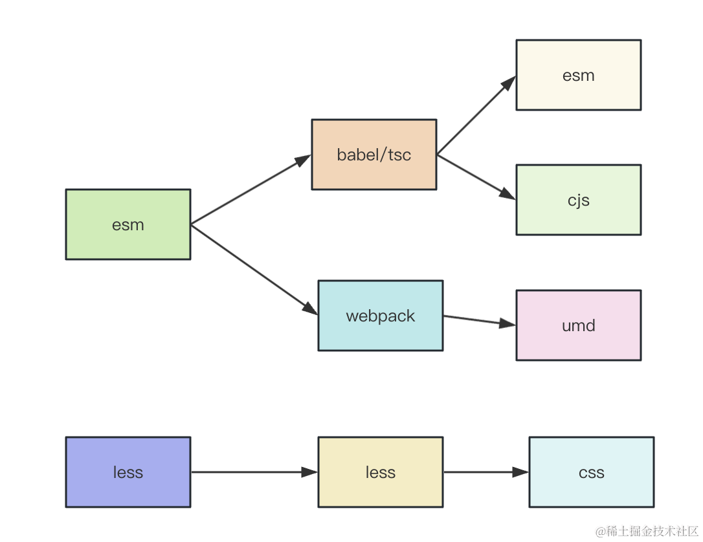
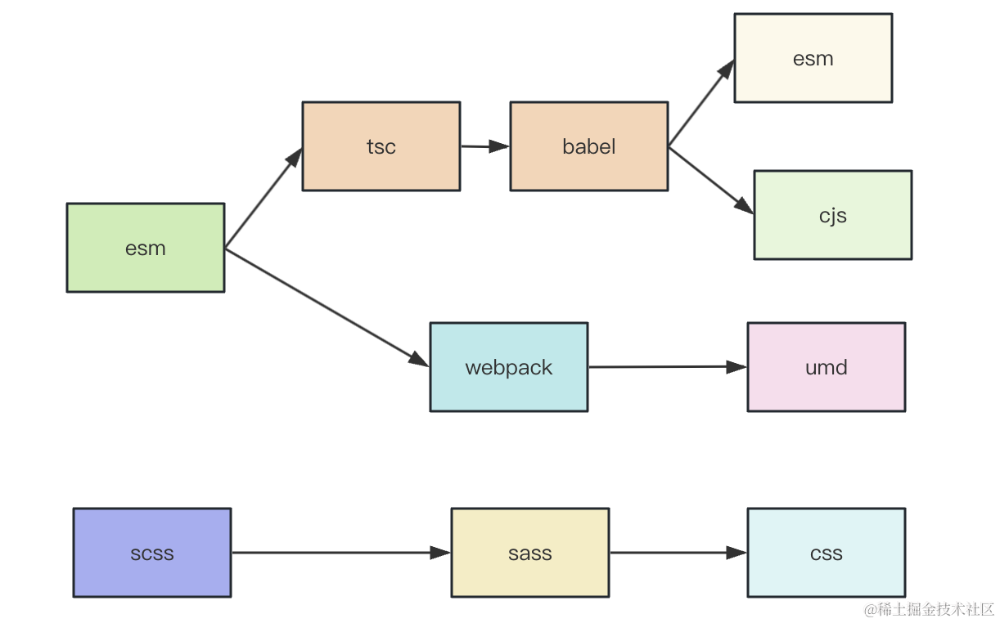

# React Components 封装
- [markdown](https://markdown.com.cn/basic-syntax/)

## 动画
- react-spring 有内置的动画效果，所以只要用 useTransition 设置 from、enter、leave 时的 style，它就会在数据变化的时候触发过渡动画。
- react-transition-group 是通过 className 的修改来实现过渡动画，而且要自己用 transition 的 css 来控制动画效果：
    - 进入的时候会触发 enter、enter-active、enter-done 的 className 切换
    - 离开的时候是 exit、exit-active、exit-done 的切换
    - 如果设置了 appear 参数，刚出现的时候，还会有 appear、appear-active、appear-done 的切换。
    - 它有 Transition、CSSTransition、TransitionGroup、SwitchTransition 这 4 个组件。

## 组件库打包流程
### 流程
- 分析了 ant-design、semi-design、arco-design 组件库的产物和编译打包逻辑。
- 它们都有 lib、es、dist 目录，分别放着 commonjs、es module、umd 规范的组件代码。
- 并且在 package.json 里用 main、module、unpkg 来声明了 3 种规范的入口。
- 它们编译 esm 和 cjs 代码都用了 babel 和 tsc 来编译，只不过 arco-design 是用 tsc 或者 babel 二选一，而 ant-design 和 semi-design 是先用 tsc 编译再用 babel 编译。
- 打包出 umd 的代码，三个组件库都是用的 webpack，只不过有的是把 webpack 配置内置了，有的是放在组件库项目目录下。
- 而样式部分，ant-design 是用 css-in-js 的运行时方案了，不需要编译，而 arco-design 用的 less，样式放组件目录下维护，semi-design 用的 scss，单独一个目录来放所有组件样式。
- 并且编译任务都是用的 gulp 来组织的，它可以串行、并行的执行一些任务。

### 流程图解
- arco-design

- semi-design

